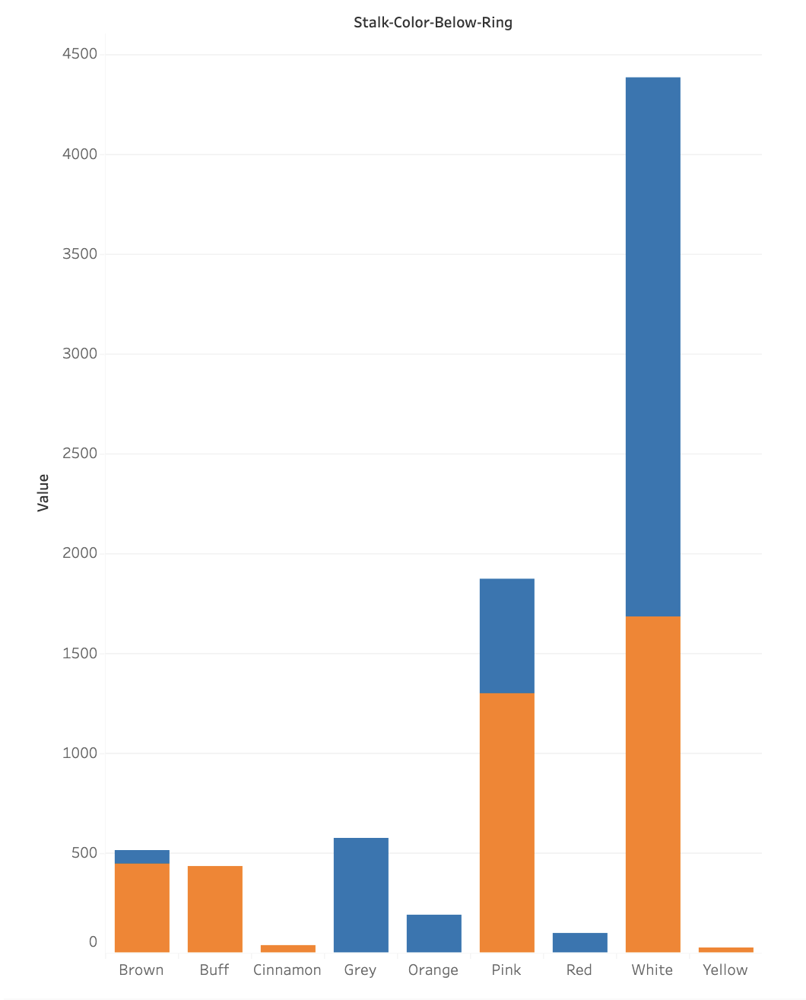

# Mushroom Madness!: Toxicity Safety Guide 
### Pattern Prophets Team Members: 
### Lauren Ables-Torres, Berenice Ramos, Rachel Puzycki, Holt Jones

## Project Description: 
This project aims to develop a predictive classification model using different algorithms including Logistic Regression, Random Forest, Neural Networks, and SVM to classify various attributes of mushrooms. Using the Mushroom dataset from UC Irvine Machine Learning Repository, we will focus on predicting the edibility of mushrooms based on features that include cap shape, cap color, odor, habitat, and others.

## Research Questions:
Are certain mushroom characteristics (i.e. cap shape/color, odor, gill size, etc.) that indicate it is more likely that the mushroom is poisonous? 
Which of these characteristics is most notable in determining if a mushroom is poisonous or not?
Can we effectively predict if a mushroom is poisonous based on its outer appearances/textures?
Extra Credit**: Make a chatbox that allows you to know the probability of a mushroom being poisonous based on one of the characteristics.

## Datasets Used: 
For this project we decided to utilize data compiled by the UC Irvine Machine Learning Repository, titled “Mushroom”, indicating different mushroom variables such as poisonous status, cap shape, color, gill size, and odor. All of these variables can allow us to predict different aspects of mushrooms.

## Data Visualization
### Colors of Mushroom Attributes v Toxicity

### Bruising, Odor, and Population Types v. Toxicity

## Model Visualization
### Random Forest Model

(Write Here)

### Neutral Networks

(Write Here)

### Linear Regression

(Write Here)

### SVC

(Write Here)

## Challenges/Conclusion
Although this dataset was easy to use, it was made in part to be used to teach students like ourselves different ways of achieving 100% accuracy in our testing. 

In the future, adjusting columns and taking into account more null/outlier indicators will be best. We would also like to create a website which could be more interactive and useful to the public.

License
------------------------
This dataset is licensed under a Creative Commons Attribution 4.0 International (CC BY 4.0) license.
